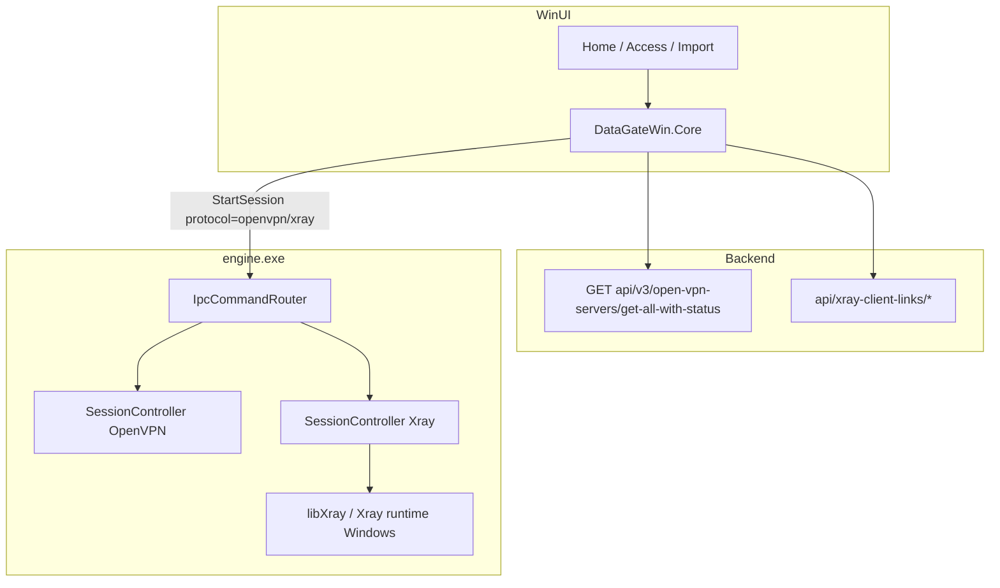

# Plan: Xray on Windows (libXray submodule + engine + UI)

Status: **implementation plan** (no open questions).  
Base: WinUI unpackaged client @ `feature/winui3-migration`; Android reference `F:\Android\DataGateAndroid` (libXray + `api/xray-client-links`).  
Goal: catalog + imported Xray connect parity with Android where Windows allows; keep OpenVPN+WSS path intact.

---

## 0. Locked decisions

| Item | Decision |
|------|----------|
| Submodule | `native-libxray` → `https://github.com/XTLS/libXray.git` (same as Android) |
| Pin | Match Android ship: submodule tag **v1.260728.0** / release **v26.7.28** (bump together later) |
| Server list API | **Only** `GET api/v3/open-vpn-servers/get-all-with-status` (`VpnServerWithStatusesV3Response`) — already used in Core/UI; do not reintroduce v2 list endpoints |
| Xray credentials API | Mirror Android: `api/xray-client-links/download-file-by-cn` + `api/xray-client-links/add-with-token` (share-link text body, same ensure/download pattern as OpenVPN files) |
| Process model | Engine owns the tunnel. UI only IPC. No second Go runtime in the WinUI process |
| OpenVPN | Unchanged catalog path (`useWssBridge=true`). Imported OpenVPN keeps `useWssBridge=false` |

---

## 1. Current baseline (facts)

- List client: [`OpenVpnServersApiClient`](DataGateWin.Core/Services/VpnServers/OpenVpnServersApiClient.cs) → **v3** + dedupe.
- Windows filter: [`WssServerSelector.IsWindowsSupported`](DataGateWin.Core/Services/VpnServers/WssServerSelector.cs) = `OpenVpn && IsEnableWss` → **Xray rows dropped** (Access/Home/manual).
- Fixture: Xray e.g. id `76`, `serverType=1`, `isEnableWss=false`, `apiUrl=https://xs2.datagateapp.com`.
- Import UI: Xray protocol stub only ([`ImportPage`](DataGateWin.WinUI/Pages/ImportPage.xaml.cs)).
- Engine: OpenVPN3 + optional WSS bridge; no Xray.
- Docs still say “do not port Xray” ([`DNS_AND_CONNECT_HISTORY.md`](docs/DNS_AND_CONNECT_HISTORY.md)) — this plan **supersedes** that for Windows once executed.

---

## 2. Architecture

---

## 3. Phase A — Submodule + Windows Xray runtime

1. Add git submodule `native-libxray` → XTLS/libXray @ pinned tag (document in `docs/BUILD_LIBXRAY_WINDOWS.md`).
2. **Runtime packaging (pick primary, keep fallback):**
   - **Primary:** build **Windows amd64 C-shared / DLL** (or static lib) from libXray Go entrypoints used on Android: `convertShareLinksToXrayJson`, `runXrayFromJson`, `stopXray`, `getXrayState` (apiVersion 1). Wire from `engine` via thin C++ `XrayRuntime` facade (parity with Android `XrayCoreFacade`).
   - **Fallback if gomobile-style API is awkward on desktop:** ship official **Xray-core `xray.exe`** next to `engine.exe`, drive it with generated JSON + process lifecycle from the same facade (still no UI-side Go).
3. CMake: target `xray-runtime` + copy artifact into `engine/Release` and publish/installer layout (`engine\` folder).
4. CI/local script: `scripts/libxray/build-windows.*` (mirror Android `scripts/libxray`).

**Windows tunnel mode (locked for v1):** Xray JSON with **TUN inbound** (Wintun / stack already used by OpenVPN path) + admin elevation (already required for Release). Port Android `XrayConfigBuilder` ideas (private CIDR direct rules without geoip.dat; optional IP-list split later). Do **not** rely on “TUN teardown restores DNS” — reuse existing NRPT/SearchList recovery on stop/start/`--recover-dns`.

---

## 4. Phase B — Engine IPC + session

1. Extend `StartOptions` / IPC payload:
   - `protocol`: `"openvpn"` | `"xray"` (default `openvpn` for back-compat).
   - OpenVPN: existing fields (`ovpnContent`, `useWssBridge`, bridge…).
   - Xray: `xrayShareLinks` (UTF-8 text) and/or `xrayConfigJson`; engine may call `convertShareLinksToXrayJson` then merge TUN/DNS/routing like Android builder.
2. `SessionController`: mutual exclusion — only one of OpenVPN / Xray active; Stop tears down the active stack.
3. Events: reuse `Connected` / `Disconnected` / log lines with `[xray]` prefix; surface VPN IPv4 when available.
4. Protect/control-plane: ensure API/`xs*` HTTPS and Xray outbound sockets are not blackholed by TUN (Windows analogue of Android `protect` — bind/exclude or route before tunnel up). Document in DNS history doc.
5. Unit/integration: engine smoke with a fixture share-link → start → stop (lab).

---

## 5. Phase C — Core (API + connect policy)

1. **Keep** `OpenVpnServersApiClient.GetAllWithStatusAsync` on **`api/v3/open-vpn-servers/get-all-with-status` only**. Add a one-line guard/test: fail CI if any code path calls a non-v3 list URL.
2. Add `XrayClientLinksApiClient` (port of Android client):
   - `ensureAndDownloadDeviceFile(vpnServerId, commonName, externalId, issuedTo)`
   - endpoints: `api/xray-client-links/download-file-by-cn`, `api/xray-client-links/add-with-token`
   - response shape same family as OpenVPN files (base64 `content` + `issuedOvpn` filename).
3. Rename/generalize selector (keep type name or introduce `VpnServerSelector`):
   - `IsOpenVpnWindowsSupported` = OpenVpn + WSS (today’s rule).
   - `IsXrayWindowsSupported` = `ServerType == Xray` + quota access (+ online for auto-pick).
   - `FilterEligible` for Home connect: OpenVPN∪Xray by mode, or unified list with type.
   - Access page: show **both** types (badges); stop hiding Xray.
4. `StartSessionPayloadBuilder`:
   - Branch on selected row `ServerType`.
   - OpenVPN: existing WSS mint path.
   - Xray: CN scheme parity with Android (`wdg-…` or their Xray CN); download share-link bytes → UTF-8 text → payload `protocol=xray`, `xrayShareLinks=…`, `useWssBridge` omitted/false.
5. Imported profiles: enable Xray in store/validator (share link / JSON); `ImportedXrayPayloadBuilder`; connect via same IPC.
6. Tests: update `WssServerSelectorFilterTests` (Xray eligible when intended); add Xray client links deserialize tests; fixture still v3.

---

## 6. Phase D — UI (WinUI)

1. **Home:** server list includes Xray catalog rows; mode Auto may prefer OpenVPN or least-loaded among both (match Android `VpnServerConnectPolicy` ranking once ported); Connect calls typed payload builder.
2. **Access:** show Xray servers; type icon/label (port `VpnServerTypeUi` concept).
3. **Import:** unlock Xray — paste share links / `.json`; remove “coming soon”; Connect uses imported Xray path.
4. Status/logs: distinguish OpenVPN vs Xray in Home status line.
5. Loc en/ru for new strings; update smoke tests / checklist.

---

## 7. Phase E — Packaging / docs / cutover

1. Installer + publish: include Xray runtime next to `engine.exe`.
2. Update [`docs/DNS_AND_CONNECT_HISTORY.md`](docs/DNS_AND_CONNECT_HISTORY.md): remove “do not port Xray”; add Windows TUN/DNS rules for Xray.
3. Add `docs/BUILD_LIBXRAY_WINDOWS.md` + `docs/XRAY_WINDOWS_INTEGRATION_PLAN.md` (this file).
4. `WINUI3_PARITY_CHECKLIST`: tick Xray when smoke passes.
5. Release notes: Xray catalog + import; still OpenVPN+WSS for classic nodes.

---

## 8. Suggested implementation order

| Step | Deliverable | Done when |
|------|-------------|-----------|
| A1 | Submodule + pin + docs stub | `git submodule status` shows libXray |
| A2 | Windows runtime artifact building | `engine` links/loads runtime |
| B1 | IPC `protocol=xray` + start/stop | Manual IPC smoke |
| C1 | `XrayClientLinksApiClient` + v3-only assert | Unit tests green |
| C2 | Selector shows/connects Xray | Home can pick Norway xray-like row |
| D1 | Import Xray + Access badges | UI smoke |
| E | Installer + DNS doc | Packaged smoke on clean Win10/11 |

---

## 9. Explicit non-goals (this plan)

- Rewriting OpenVPN WSS bridge.
- Shipping geoip.dat dependency if avoidable (prefer explicit private CIDR rules like Android).
- Running Go inside `DataGateWin.exe`.
- Calling any **v2** (or other) server-list endpoint for catalog.

---

## 10. Risk register

| Risk | Mitigation |
|------|------------|
| libXray Windows API ≠ Android AAR | Facade + fallback `xray.exe`; pin same convert/run/stop contract |
| TUN + DNS machine-wide breakage | Reuse recover-dns; never add static NIC DNS without recovery |
| Dual session races | Single `SessionController` owner; reject second Start |
| Quota/API differences for Xray CN | Copy Android CN/`issuedTo` exactly; log API bodies on failure |
| Larger binary | Self-contained engine folder; document size in release notes |
