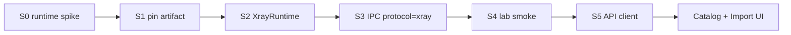
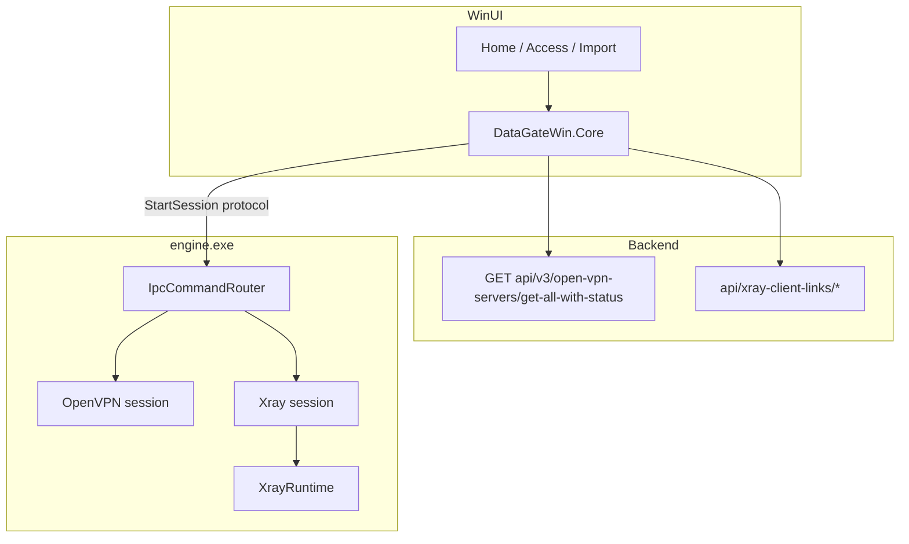

# Plan: Xray on Windows

See also: [`XRAY_WINDOWS_REMAINING.md`](XRAY_WINDOWS_REMAINING.md) (gap plan + test strategy).

---

## Starter plan (do this first)

Goal of the starter: **prove Windows can run one Xray share-link through `engine.exe`**, without finishing catalog UI.

| # | Task | Done when |
|---|------|-----------|
| **S0** | Spike runtime | ✅ Official `libXray.dll` (v26.7.28) via `CGoInvoke` — see `docs/BUILD_LIBXRAY_WINDOWS.md`. |
| **S1** | Submodule / artifact | ✅ `scripts/libxray/fetch-windows.ps1` → `engine/third_party/libxray/`; CMake + Build-* copy beside `engine.exe`. |
| **S2** | Engine facade | ✅ `XrayRuntime` + `XrayConfigBuilder` (Windows TUN JSON). |
| **S3** | IPC | ✅ `protocol:"xray"` + `xrayShareLinks` / `xrayConfigJson`; mutual exclusion via single session. |
| **S4** | Lab smoke | ⬜ Manual: paste Android-known share link → IPC start → traffic/TUN → stop. |
| **S5** | Core API stub | ✅ `XrayClientLinksApiClient` + unit tests. **No UI unlock yet.** |

**After S0–S5:** catalog selector + Access/Home/Import (Phases C–D). Do **not** unlock Import Xray or show Xray rows until S4 is green.

### Locked for starter

- Server list stays **v3 only** (`api/v3/open-vpn-servers/get-all-with-status`).
- Tunnel = **TUN / Wintun** + existing DNS recovery (no new NIC DNS without recover).
- Xray lives in **engine**, not in WinUI.
- OpenVPN+WSS path unchanged.

### Explicitly later (not starter)

- Access/Home Xray rows + badges  
- Import Xray (remove “coming soon”)  
- Auto-pick ranking vs OpenVPN  
- Installer size / release notes polish  

---

## 0. Locked product decisions

| Item | Decision |
|------|----------|
| Submodule | `native-libxray` → `https://github.com/XTLS/libXray.git` (same as Android) |
| Pin | Match Android: tag **v1.260728.0** / release **v26.7.28** |
| Server list API | **Only** `GET api/v3/open-vpn-servers/get-all-with-status` |
| Xray credentials API | `api/xray-client-links/download-file-by-cn` + `add-with-token` (Android parity) |
| Process model | Engine owns tunnel; UI only IPC |
| OpenVPN | Catalog `useWssBridge=true`; imported OpenVPN `useWssBridge=false` |

---

## 1. Current baseline

- List: [`OpenVpnServersApiClient`](../DataGateWin.Core/Services/VpnServers/OpenVpnServersApiClient.cs) → v3.
- Filter: [`WssServerSelector.IsWindowsSupported`](../DataGateWin.Core/Services/VpnServers/WssServerSelector.cs) = OpenVpn + WSS → **Xray hidden**.
- Import: Xray = coming soon ([`ImportPage`](../DataGateWin.WinUI/Pages/ImportPage.xaml.cs)).
- Engine: OpenVPN3 + WSS bridge only.
- Android: `XrayCoreFacade` (`convertShareLinksToXrayJson` / `runXrayFromJson` / `stopXray`), `XrayClientLinksApiClient`.

---

## 2. Target architecture

---

## 3. Phase A — Runtime (maps to S0–S1)

1. Submodule or pinned `xray.exe` download script (`docs/BUILD_LIBXRAY_WINDOWS.md`).
2. Primary: libXray Windows library with Android-like API. Fallback: `xray.exe` + JSON.
3. CMake copies artifact next to `engine.exe` / publish `engine\`.

**TUN:** build client JSON with TUN inbound (Wintun); reuse `--recover-dns` on stop/fail.

---

## 4. Phase B — Engine IPC (maps to S2–S4)

1. Payload: `protocol`: `"openvpn"` \| `"xray"`; Xray fields `xrayShareLinks` / `xrayConfigJson`.
2. One active session; Stop tears down the active stack.
3. Events: `Connected` / `Disconnected` / `[xray]` logs.
4. Exclude API/`xs*` and Xray outbound from TUN blackhole (Windows protect analogue).
5. Lab smoke start/stop.

---

## 5. Phase C — Core (maps to S5 + catalog)

1. Keep v3 list only (contract test already exists).
2. `XrayClientLinksApiClient` (Android port).
3. Selector: `IsOpenVpnWindowsSupported` + `IsXrayWindowsSupported`; Access shows both.
4. `StartSessionPayloadBuilder` branches on `ServerType`.
5. Imported Xray validator + payload builder.
6. Tests for selector + links client.

---

## 6. Phase D — UI

1. Home: Xray rows + connect.
2. Access: type badge.
3. Import: unlock Xray paste/file.
4. Loc en/ru + smoke tests.

---

## 7. Phase E — Ship

1. Installer/publish includes Xray runtime.
2. Update `DNS_AND_CONNECT_HISTORY.md` (remove “do not port Xray”).
3. Checklist + release notes.

---

## 8. Non-goals

- Rewriting OpenVPN WSS bridge.
- Go runtime inside `DataGateWin.exe`.
- geoip.dat if private CIDR rules suffice.
- Any non-v3 catalog list API.

---

## 9. Risks

| Risk | Mitigation |
|------|------------|
| libXray Windows ≠ Android AAR | Facade + `xray.exe` fallback |
| DNS / TUN leftover | Existing recover-dns path |
| Dual session | Single SessionController owner |
| CN / quota mismatch | Copy Android CN scheme exactly |
